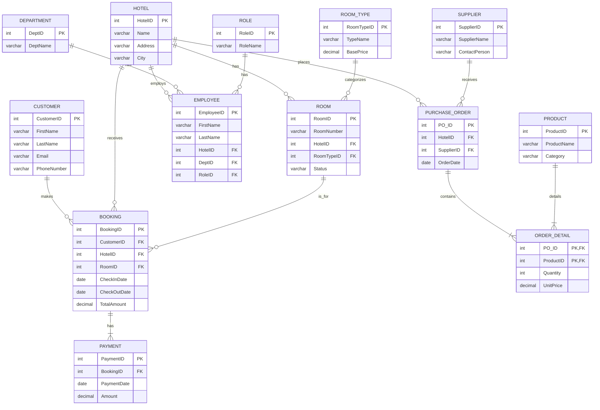

# HotelSphere: An Integrated SQL Database for Hotel Chain Management

## 1\. Introduction

[cite\_start]HotelSphere is a centralized, end-to-end, enterprise-grade SQL database solution designed to manage the complex operations of a multi-location hotel chain[cite: 2, 17]. [cite\_start]Modern hotel chains often suffer from data fragmentation, where critical information is stored in separate, non-integrated systems, leading to data redundancy, operational inefficiency, and impaired decision-making[cite: 6, 10, 11, 14].

[cite\_start]This project solves these challenges by integrating Enterprise Resource Planning (ERP), Customer Relationship Management (CRM), and Supply Chain Management (SCM) modules into a single, cohesive, and normalized relational database[cite: 18]. [cite\_start]The primary goal is to ensure data integrity, eliminate redundancy, streamline operations, and provide powerful business intelligence capabilities to support strategic decision-making[cite: 19].

## 2\. Key Features

  * [cite\_start]**Integrated Management System**: A single, unified system combining modules for CRM, ERP (HR & Payroll), and SCM (Procurement & Inventory)[cite: 18, 613].
  * [cite\_start]**Core Operations & CRM**: Manage hotel branches, room types, individual rooms, customer information, bookings, payments, and a customer loyalty program [cite: 23-40].
  * [cite\_start]**Enterprise Resource Planning (ERP)**: Handle all staff information, including departments, job roles, employee records, and payroll processing [cite: 41-51].
  * [cite\_start]**Supply Chain Management (SCM)**: Oversee suppliers, product catalogs, purchase orders, and track inventory levels in each hotel's dedicated warehouse [cite: 52-66].
  * [cite\_start]**Fully Normalized & Scalable Architecture**: The database schema is normalized to Boyce-Codd Normal Form (BCNF) to guarantee data integrity, minimize redundancy, and prevent modification anomalies[cite: 264, 602]. [cite\_start]This robust architecture can easily scale to accommodate business growth[cite: 616].

## 3\. Database Schema (ER Diagram)

The database schema is built upon a detailed Entity-Relationship model that logically structures the business operations. [cite\_start]The final design consists of 18 relations, each normalized to BCNF to ensure a robust and efficient structure[cite: 299, 301].

[cite\_start]The ER Diagram below visualizes the entities, their key attributes, and the relationships between them[cite: 155].



> [cite\_start]*This diagram was generated using the Mermaid script provided in the project report[cite: 157, 158].*

## 4\. Technologies Used

  * [cite\_start]**Database**: MySQL [cite: 320]
  * **Language**: SQL (for DDL, DML, and querying)

## 5\. Getting Started

To get a local copy up and running, follow these simple steps.

### Prerequisites

You need a running instance of MySQL server. You can download it from the [official MySQL website](https://www.mysql.com/downloads/).

### Installation

1.  **Clone the repository:**
    ```sh
    git clone https://github.com/your_username/HotelSphere.git
    ```
2.  **Navigate to the project directory:**
    ```sh
    cd HotelSphere
    ```
3.  **Create the database:**
    Log in to your MySQL server and create a new database.
    ```sql
    CREATE DATABASE HotelSphereDB;
    ```
4.  **Create the tables:**
    [cite\_start]Run the `schema.sql` script to create all the necessary tables and relationships[cite: 318].
    ```sh
    mysql -u your_username -p HotelSphereDB < schema.sql
    ```
5.  **Populate the database (Optional):**
    [cite\_start]Run the `data.sql` script to populate the tables with sample data for testing and demonstration[cite: 444, 445].
    ```sh
    mysql -u your_username -p HotelSphereDB < data.sql
    ```

## 6\. Usage & Example Queries

[cite\_start]The HotelSphere database is designed to answer critical business questions and extract valuable insights[cite: 545]. Below are some examples of the analytical queries that can be performed.

#### Query 1: Get Current Occupancy Rate for a Specific Hotel

[cite\_start]Calculates the percentage of rooms currently occupied in Hotel \#1[cite: 546].

```sql
SELECT
    h.Name AS HotelName,
    (COUNT(b.BookingID) / (SELECT COUNT(*) FROM Room WHERE HotelID = h.HotelID)) * 100 AS OccupancyRatePercentage
FROM Hotel h
LEFT JOIN Room r ON h.HotelID = r.HotelID
LEFT JOIN Booking b ON r.RoomID = b.RoomID
WHERE
    h.HotelID = 1 -- Change HotelID to check other hotels
    AND CURDATE() BETWEEN b.CheckInDate AND b.CheckOutDate
GROUP BY h.Name, h.HotelID;
```

#### Query 2: Find the Top 5 Most Valuable Customers

[cite\_start]Identifies the top 5 customers based on their total spending across all bookings[cite: 557].

```sql
SELECT
    c.CustomerID,
    c.FirstName,
    c.LastName,
    SUM(p.Amount) AS TotalSpent
FROM Customer c
JOIN Booking b ON c.CustomerID = b.CustomerID
JOIN Payment p ON b.BookingID = p.BookingID
GROUP BY c.CustomerID, c.FirstName, c.LastName
ORDER BY TotalSpent DESC
LIMIT 5;
```

#### Query 3: Identify Products Below Reorder Level

[cite\_start]Helps managers find which products need to be reordered across all hotel warehouses by comparing current quantity against the reorder level[cite: 572].

```sql
SELECT
    h.Name AS HotelName,
    p.ProductName,
    i.Quantity AS CurrentQuantity,
    i.ReorderLevel
FROM Inventory i
JOIN Product p ON i.ProductID = p.ProductID
JOIN Warehouse w ON i.WarehouseID = w.WarehouseID
JOIN Hotel h ON w.HotelID = h.HotelID
WHERE i.Quantity < i.ReorderLevel;
```

#### Query 4: Analyze Monthly Booking Trends

[cite\_start]Provides a report on the total number of bookings per month to analyze seasonal trends and peak periods[cite: 584].

```sql
SELECT
    DATE_FORMAT(CheckInDate, '%Y-%m') AS BookingMonth,
    COUNT(BookingID) AS NumberOfBookings
FROM Booking
GROUP BY BookingMonth
ORDER BY BookingMonth;
```

## 7\. Repository Structure

```
.
├── README.md           # This file
├── Project_Report.pdf  # The original detailed project report
├── schema.sql          # SQL DDL scripts to create the database schema
├── data.sql            # SQL DML scripts with sample data for population
└── queries.sql         # Sample business intelligence SQL queries
```
